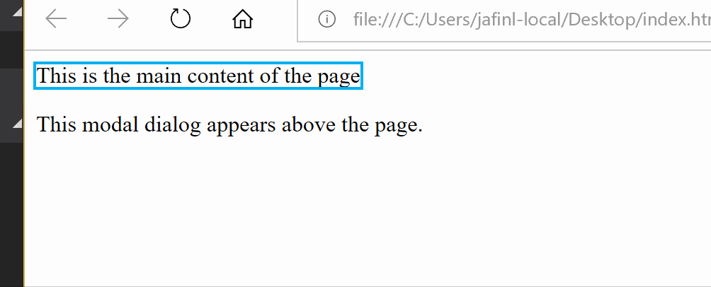
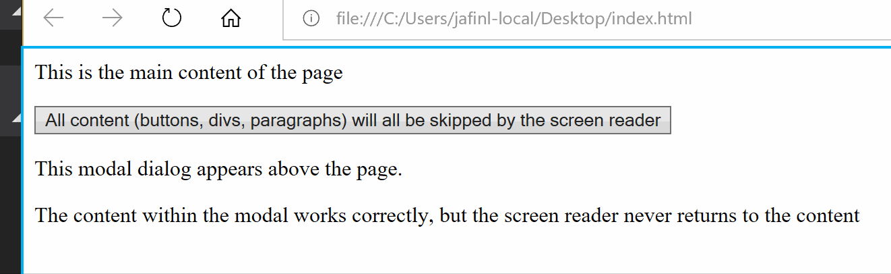
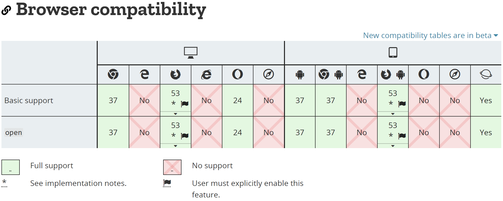
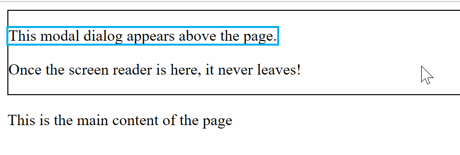

Cross-platform solutions for screen reading aren't as simple as they should be. **Accessibility is hard.** A recent issue I came across was when showing a modal dialog on a website. As it opened, we set focus within the modal window but the screen reader would fall to the rest of the page when reaching the end. This meant the elements behind the modal began receiving narration. 

This is a confusing problem for users. When the modal is open, they should only be interacting with the modal div. This needed to be fixed.

## Cross-platform solution

TL;DR - apply `aria-hidden` to *everything*.

The first option that is guaranteed to work across browsers is to apply `aria-hidden="true"` to every field in the background when our modal is open. When the modal closes, reset the aria field. It works across all modern browsers, it is a simple solution, but may not be the easiest change if you are improving a large project and need to restructure the DOM.

`aria-hidden="true"` is an accessibility property that tells screen readers they should ignore the element. This is distinct from the `hidden` property which tells the browser whether to render the element.

Here is a simple DOM with two separate divs, one that contains the main page content and a second that is our pretend modal dialog that we expect to capture the screen reader.

```javascript
<html>
    <body>
        <div id="content">
            <p>This is the main content of the page</p>
        </div>
        <div id="modal">
            <p>This modal dialog appears above the page.</p>
        </div>
    </body>
</html>
```



By default, our screen reader (Microsoft Narrator through Edge in this case), jumps between both lines. If we were to style the modal to look more like an actual dialog, the screen reader behavior would not change and it would fall behind the modal to the content.

Instead, if we add `aria-hidden="true"` to the "content" div, the screen reader will jump over it and all of it content and just read the modal.

```javascript
<body>
    <div id="content" aria-hidden="true">
        <p>This is the main content of the page</p>
        <button>All content (buttons, divs, paragraphs) will all be skipped by the screen reader</button>
    </div>
    <div id="modal">
        <p>This modal dialog appears above the page.</p>
        <p>The content within the modal works correctly, but the screen reader never returns to the content</p>
    </div>
</body>
```



This works across all browsers and is the best solution we have today. 

The biggest limitation here is that this solution is difficult if your modal dialog is within of your main content tree. In the following snippet, we can't hide the content while keeping the modal accessible. Setting `aria-hidden="false"` to an inner element does not unhide it if the parent is hidden. We would have to restructure the DOM to move the modal element outside.

```javascript
<body>
    <div id="content" aria-hidden="true">
        <p>This is the main content of the page</p>
        <button>All content (buttons, divs, paragraphs) will all be skipped by the screen reader</button>

        <div id="modal">
            <p>How do I get focus in here?</p>
        </div>
    </div>
</body>
```

A great example of this functionality for React can be found on [@ryanflorence](https://twitter.com/ryanflorence)'s site, [https://ui.reach.tech/dialog](https://ui.reach.tech/dialog).

## \<dialog\>

Chrome, Firefox (behind flight), and Opera.

Another option I came across, which does not have full browser support, is to wrap the modal in the [HTML \<dialog\> element](https://developer.mozilla.org/en-US/docs/Web/HTML/Element/dialog). This can be used to present your content in the form of a dialog box, and the browser will contain the screen reader within the dialog.



This does not have full support of all browsers, and adds some styling of its own. But does not require manual manipulation of screen reader behavior.

## aria-flowto and x-ms-aria-flowfrom

A final option, which doesn't have full browser support either, is to use [aria-flowto](http://www.w3.org/TR/wai-aria-practices-1.1/#relations_flowto) to tell the screen reader where to navigate. The intent of this attribute is to define the order in which the screen reader accesses the page. We can lock the screen reader in a modal by directing the screen reader to flow back to itself. 

In the snippet following, we point the `aria-flowto` field of the modal back to the modal element. Once the screen reader has entered the modal, it will not leave. We also need to use [x-ms-aria-flowfrom](https://developer.mozilla.org/en-US/docs/Web/Accessibility/ARIA/ARIA_Techniques/x-ms-aria-flowfrom) to prevent the screen reader from leaving in the reverse direction.

```javascript
<body>
    <div id="modal" aria-flowto="modal" x-ms-aria-flowfrom="modal" style="border: 1px solid black;">
        <p>This modal dialog appears above the page.</p>
        <p>Once the screen reader is here, it never leaves!</p>
    </div>
    <div id="content">
        <p>This is the main content of the page</p>
    </div>
</body>
```



Naturally, this isn't supported everywhere. `aria-flowto` is supported in Firefox and Edge. `x-ms-aria-flowform` is non-standard and supported by IE and Edge. So for now, we have to stick with `aria-hidden`!

Please let me know if you have other solutions :)