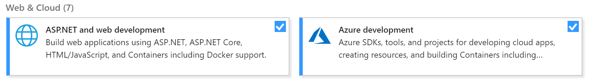
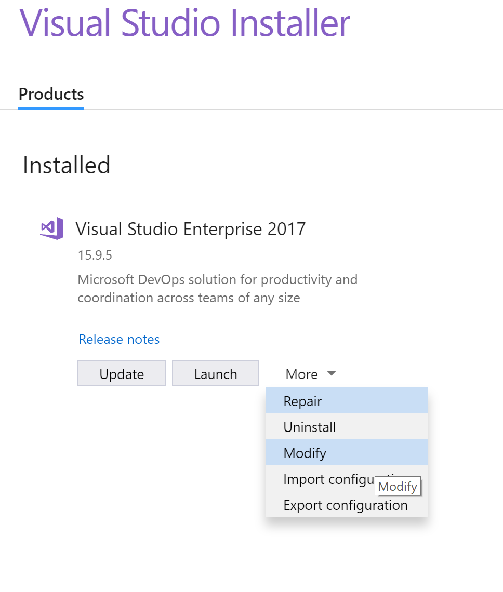
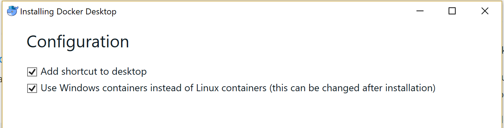
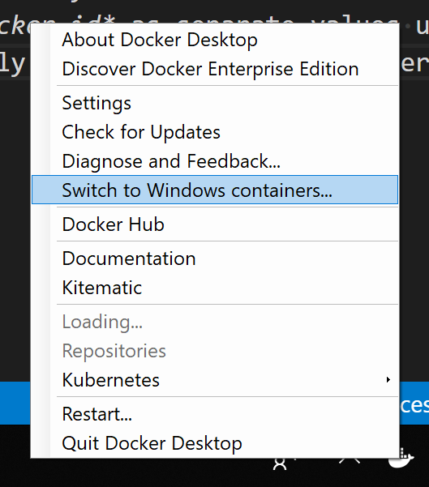
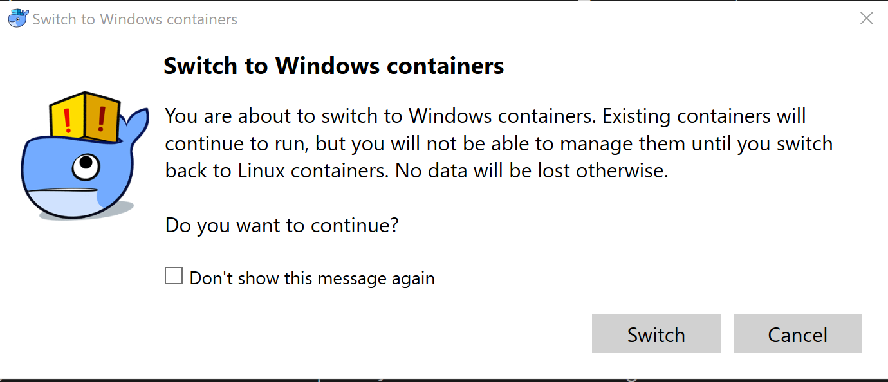
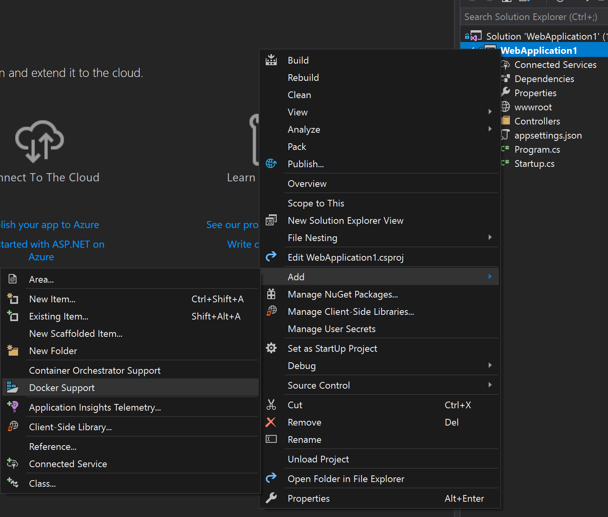

Whether starting with a new project or publishing an existing, integrating your ASP.NET Core project with Docker is a powerful way to manage and ship your programs. It's straight forward to achieve with Visual Studio, and this guide is to help add this support.

You'll learn to:
    ✔ Create an ASP.NET Core API Service
    ✔ Setup Docker for Windows
    ✔ Enable Docker support for your service

Using Visual Studio Installer (with VS2017), ensure you have the following options installed:
 - ASP.NET and web development
 - Azure development

These options can be accessed through the 'Modify option' of the Visual Studio Installer.

Before we create or update our project, another required tool is [Docker for Windows](https://docs.docker.com/docker-for-windows/?install_site=vsonwin). Install it following their guidance, which today points to [Docker Hub](https://hub.docker.com/editions/community/docker-ce-desktop-windows).

During installation, we will configure Docker to use Windows containers instead of Linux. ASP.NET Core projects are cross-platform, so we can configure our project to run on either OS. It is simple to switch between Windows containers and Linux containers - we just need to access this option through the Docker settings once it has launched.

Launch Docker For Windows. This will take a minute or two, you can see the progress by the animating icon on your toolbar. Once it's complete, it will launch a login window.

Register for an account if you do not have one yet, you will likely need it later. Something to note is that Docker login differentiates your *email address* and *docker id* as separate values using the same password. Your email address is used your website login, and your docker id for managing docker.

In my case, Docker launched for Linux Containers, so I switched to Windows Containers modes. You will be given a warning regarding not being able to manage existing Linux containers, which is expected.

## New Project

Launch Visual Studio, and go to create a new ASP.NET Core Web Application. Check 'Enable Docker Support', verify the dropdown for Windows, and select your service of choice (in my case, an API service).

Once created, tap F5 to build & run your project.

## Existing Project

For an existing ASP.NET Core project, including docker support is straight forward as well. Right-click on your project > Add > Docker Support.

