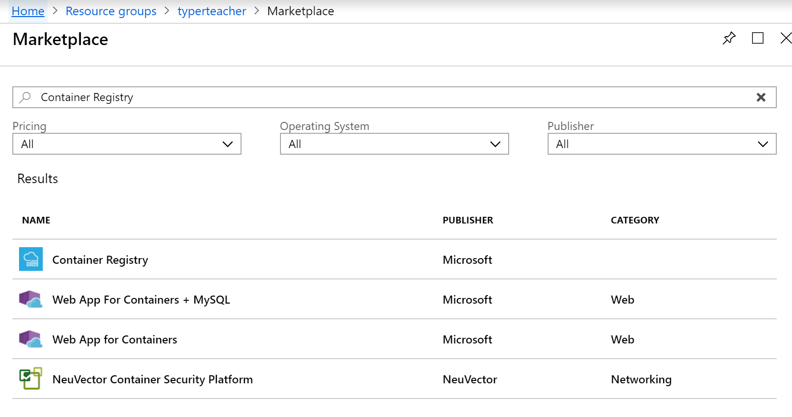
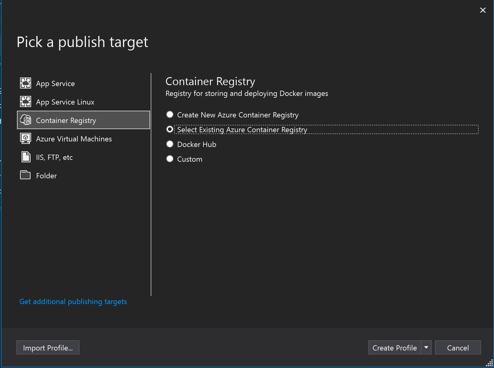
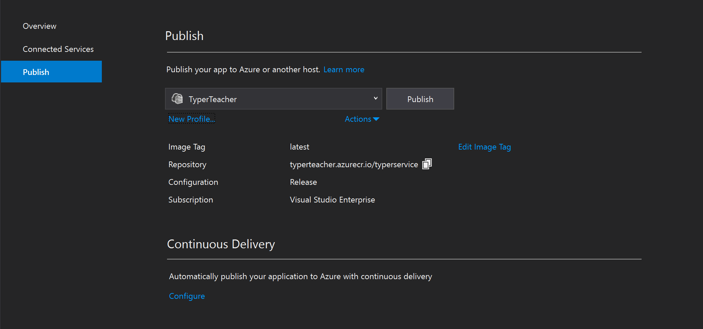
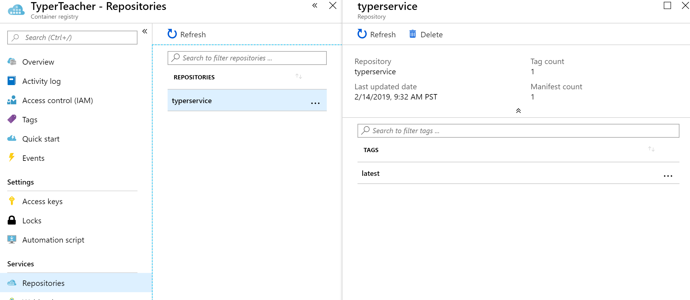
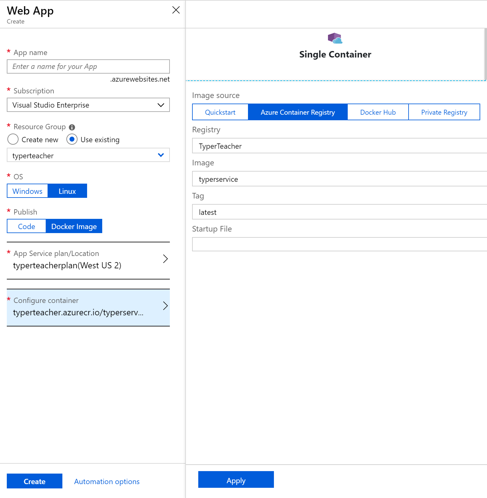
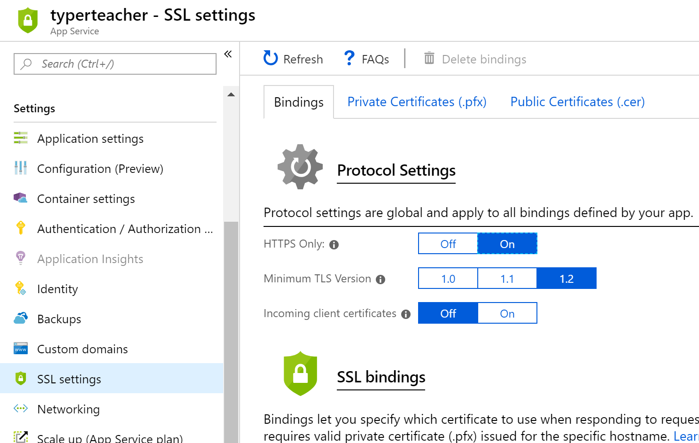

Docker containers are a great tool for continuous delivery of software to production. It allows us to clearly define exactly how we want our application's environment to be configured, keeping it consistent and reliable. Containers are similar to Virtual Machines, but are lighter in snapshot size, spin up quicker, and have reduced complexity. This makes containers ideal for configuring many applications on a minimal number of servers.

Azure provides easy integration with Docker via their Web Apps platform. Azure supports hosting containers on Linux and Windows, but setting it up has some difficulties. In this guide we can walk through some of the failures I hit on the Linux path, along with the easiest path to create and deploy.

In this guide, we'll walk through:

✔ Publish a container to Azure Container Registry

✔ Create a web app from the registry

## Prerequisites

- [Docker](https://www.docker.com/)
- If on Windows, you can [follow my guide](./aspnet-docker) for setting up Docker for Windows and Visual Studio.
- Azure account

# Create an Azure Container Registry

An Azure Container Registry allows us to manage and store our containers in a private registry. It ties directly into the Azure portal, and supports publishing directly from Visual Studio. It can also be used for automated publishing from other sources.

To configure a new registry, we will go to the [Azure portal](https://portal.azure.com) and create a new Resource Group for our service.

When I first went down this path, I hit some issues. It turns out that **Linux containers are only supported in specific regions**, and discovering these regions cannot (today) be done from the UI. Later on, when creating the web app, I hit a deployment failure that tied back to the resource being in the wrong region.


In order to lookup the regions to support, we need to use the [Azure Cloud Shell](https://azure.microsoft.com/en-us/features/cloud-shell/). This is essentially PowerShell/bash in the browser for interacting directly with Azure. In the Azure portal, look for the Cloud Shell icon in the top bar.


Choose PowerShell and allow the Cloud Shell to use local storage. Once it is ready, we can use the *Azure CLI* to lookup all regions that support Linux containers. To see all supported locations in the Basic tier, run the following. [[Documentation]](https://docs.microsoft.com/en-us/cli/azure/appservice?view=azure-cli-latest#az-appservice-list-locations)

```
az appservice list-locations --sku B1 --linux-workers-enabled
```

And we're given the following locations (I've shortened the list for better reading).

```
[
  {
    "name": "Central US"
  },
  {
    "name": "North Europe"
  },
  {
    "name": "West Europe"
  },
  {
    "name": "West US"
  },
  {
    "name": "East US"
  },
  ...
```

We need to create our Web App and Resource Group in one of these locations. Specifying the location of the Resource Group at creation time does not seem possible through the UI, but we can rely on the Cloud Shell for this as well.

```
az group create --name myResourceGroup --location "West US"
```

Now that we have a Resource Group in the right region, we can create the Azure Container Registry. From the Resource Group, we add a new resource called `Container Registry`.



Create the new registry using the Resource Group and enable the 'Admin user' option. The location should match that of the Resource Group.

# Publish a container to Azure Container Registry

I created a new ASP.NET Core Web Application for Linux, but any existing Docker-enabled Linux application works. We're focusing on Linux because Windows has significant restrictions on the base images.

After performing a local run to ensure everything was setup properly, we can go to publish. In Visual Studio, right-click the project and select `Publish`. A window will appear for us to create a publish target profile. There are a number of options here, such as publishing directly to an App Service, VM, or through a registry. We'll select `registry` and `Select Existing Azure Container Registry`. Click `Create Profile`. On the next screen, select your resource group and the created Container Registry.



When done, you'll fall back to a Publish window with your profile available in a dropdown. You can create as many publishing profiles as you would like, if you need to push to pre-production environments directly or through other registries.



Hit publish and Visual Studio will begin building and publishing your image. This may take some time.

Once the publish has completed, return to the Azure portal and select the Container Registry. Under 'Services', we can select Repositories > "ContainerName" and view all the containers that have been uploaded.



# Create the Web App

We have now created the resource group, setup an Azure Container registry, and uploaded our build. Next we need to create a web app that runs off of the latest image.

From the Azure Portal, we create a new web app from the existing sources. Choose the same resource group, for Linux OS, and use a Docker Image as the source. When choosing the container, we can lookup the Azure Container Registry we created and we select the 'latest' tag.



Once it is created, we can keep an eye on the `Container Settings` (under **Settings**) on the web app to see how the deployment is going. The log view can show us when the deployment is complete and help diagnose failures.

We can navigate to the web app's url to ensure the web app is running as expected.

One last item before we are done is enabling **https redirection**. Clients that navigate to the http site should be redirected to https. We can enable this easily in the Azure portal, by toggling the *HTTPS Only* option in the *SSL Settings*.



Now loading the `http://` version of the url corrects the browser to `https://`. 