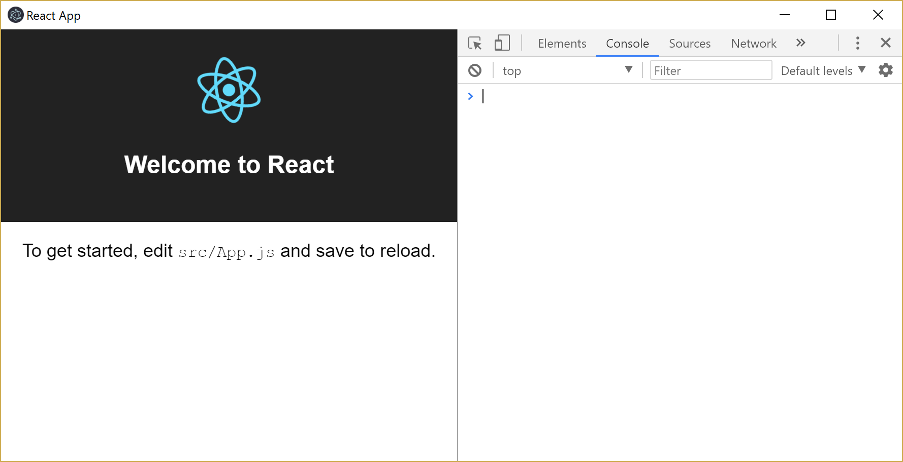

[Electron](https://electronjs.org/) is a great modern solution for building cross-platform desktops apps with HTML, Javascript, and CSS. Visual Studio Code, Teams, Slack, and many other popular software applications use electron as part of their toolkit.

I found few resources online that provided a useful way to integrate [electron-builder](https://www.electron.build/) with an existing application, such as from [create-react-app](https://github.com/facebook/create-react-app). Hopefully this will help remedy questions as I pieced together different errors and github threads.



## Create-react-app

I'm becoming a big fan of `create-react-app`. It allows you to start off running and has everything setup to build to a production-ready state.

```javascript
npx create-react-app electron-react
cd electron-react
```

## Add electron

Add `electron` to our dependencies, and `electron-builder` as a dev dependency.

```javascript
yarn add electron
yarn add electron-builder -D
```

## Developer environment

For our developer environment, we expect changes to be fast and to have support for hot reload. To accomplish this with electron, we are going to run our regular node service through `yarn start`, and concurrently serve it through our electron app.

First, we can leverage the `electron-is-dev` package to distinguish which dev from prod.

```javascript
yarn add electron-is-dev
```

To actual get our electron application to start, we begin with a copy from [electron-webpack-quick-start](https://github.com/electron-userland/electron-webpack-quick-start/blob/master/src/main/index.js). We are creating a new `electron.js` file in the public directory.

public/electron.js
```javascript
const electron = require('electron');
const app = electron.app;
const BrowserWindow = electron.BrowserWindow;

const path = require('path');
const url = require('url');
const isDev = require('electron-is-dev');

let mainWindow;

function createWindow() {
    mainWindow = new BrowserWindow({width: 900, height: 680});
    mainWindow.loadURL(isDev ? 'http://localhost:3000' : `file://${path.join(__dirname, '../build/index.html')}`);
    mainWindow.toggleDevTools();
    mainWindow.on('closed', () => mainWindow = null);
}

app.on('ready', createWindow);

app.on('window-all-closed', () => {
    if (process.platform !== 'darwin') {
        app.quit();
    }
});

app.on('activate', () => {
    if (mainWindow === null) {
        createWindow();
    }
});
```

If we are in the development environment then electron will load `http://localhost:3000`, which is our node hot reload environment (from `yarn start`). Otherwise, we try to load `../build/index.html` which is the production build.

Now we can modify our `package.json` configuration to point to this file, and define our build scripts. Start with the following field, which points electron to initiate with the `electron.js` starter script we added.

package.json
```javascript
    "main": "public/electron.js",
```

 Next, we can add an `electron-dev` script to the configuration. We want to concurrently run `yarn start` and `electron` together, so we will bring ine the [concurrently](https://www.npmjs.com/package/concurrently) package. We also can't start electron until `localhost:3000` is ready, so we will grab [wait-on](https://www.npmjs.com/package/wait-on) too.

 ```javascript
 yarn add concurrently wait-on -D
 ```

package.json
```javascript
    "scripts": {
        ...
        "electron-dev": "concurrently \"yarn start\" \"wait-on http://localhost:3000 && electron .\""
    }
```

Pull packages and run.

```javascript
yarn 
yarn electron-dev
```

So, uh, both our default browser and electron launched, which isn't ideal. That's because node will launch the browser on start (from the `yarn start`). We can clean that up by setting BROWSER=none as an environment variable. Since we are cross platform and env variables behave funny on Windows, we can add [cross-env](https://www.npmjs.com/package/cross-env) as a dev dependency.

```javascript
yarn add cross-env -D
```

...and update our script to

```javascript
{
    ...
    "electron-dev": "concurrently \"cross-env BROWSER=none yarn start\" \"wait-on http://localhost:3000 && electron .\""
}
```

Since we don't actually need the existing `yarn start` script, which just invokes "react-scripts start", we can refactor our `electron-dev` into the `start` script. Like the following package.json (version numbers may not match):

```javascript
{
  "name": "electron-react",
  "version": "0.1.0",
  "private": false,
  "main": "public/electron.js",
  "dependencies": {
    "electron": "^2.0.8",
    "electron-is-dev": "^0.3.0",
    "react": "^16.4.2",
    "react-dom": "^16.4.2",
    "react-scripts": "1.1.5"
  },
  "scripts": {
    "start": "concurrently \"cross-env BROWSER=none react-scripts start\" \"wait-on http://localhost:3000 && electron .\"",
    "build": "react-scripts build",
    "test": "react-scripts test --env=jsdom",
    "eject": "react-scripts eject"
  },
  "devDependencies": {
    "concurrently": "^4.0.1",
    "electron-builder": "^20.28.4",
    "wait-on": "^3.0.1"
  }
}
```

Boom! Development environment for electron with hot reload is live.

## Production environment

Production was a bit trickier to figure out, but here we go.