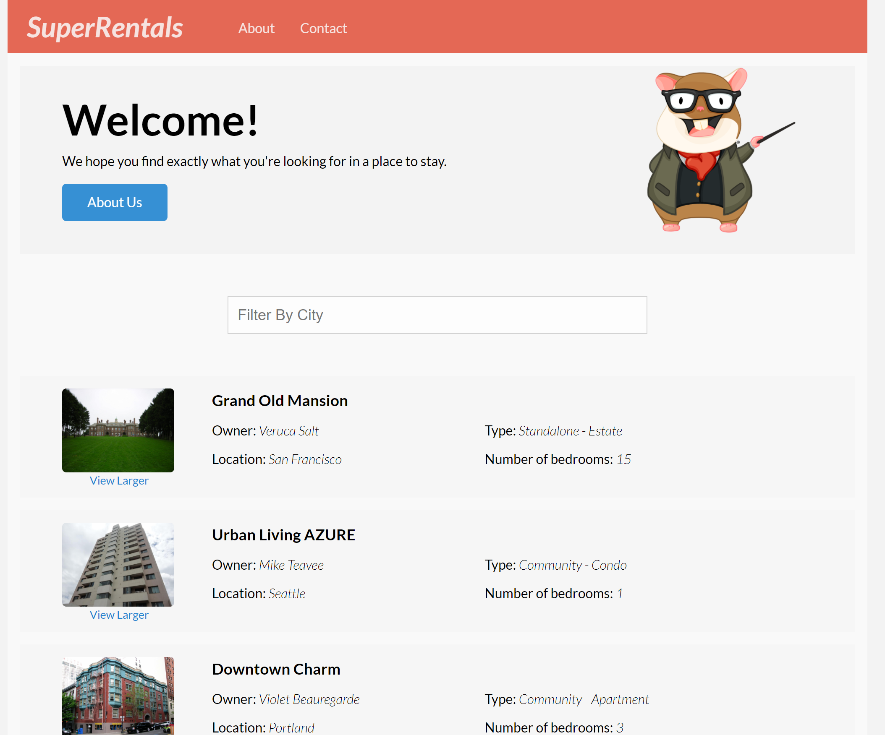
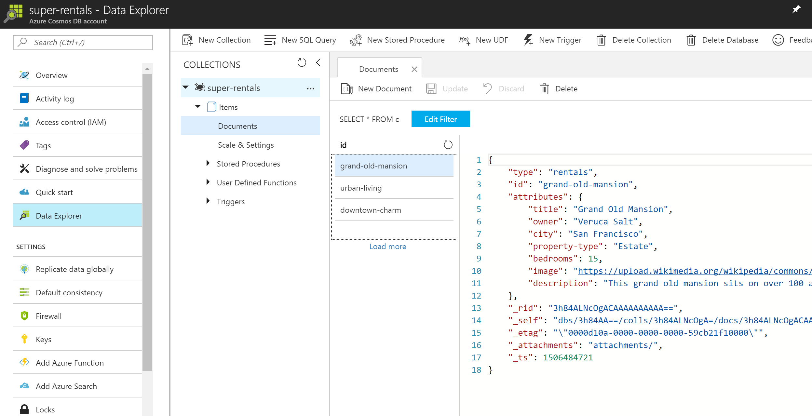
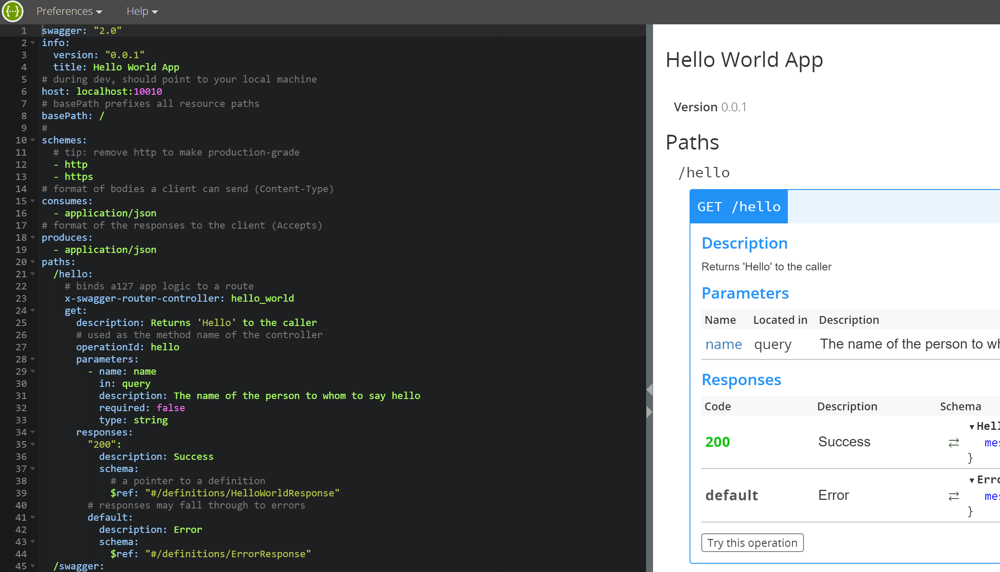
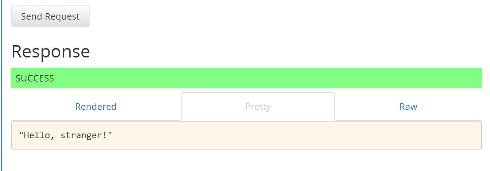

The goal with this guide is to expand the existing [EmberJS 'super-rentals' tutorial](https://guides.emberjs.com/v2.14.0/tutorial/ember-cli/) to query data against an Azure Services backend. I hope this tutorial helps others figure out the next steps in getting their application out on the web. In this section, we will set up an Azure CosmosDB (DocumentDB) database, and create an Express service with Swagger integration.

Related: [Part 2](./Super-Rentals-2/)

From the EmberJS super-rentals tutorial, you should be left off with a working Ember application that uses mirage to return mock data. We'll use this same data in an [Azure CosmosDb (DocumentDb) NoSQL database](https://docs.microsoft.com/en-us/azure/cosmos-db/introduction), and access it using a separate web service running [Express](https://expressjs.com/) (setup with [Swagger](https://swagger.io/)). We'll dive deeper into the rationale behind the separate service later.

### Pre-requisites

- Some knowledge of Nodejs
- Free Azure subscription
- Completion of the [EmberJS v2.14.0 super-rentals tutorial]((https://guides.emberjs.com/v2.14.0/tutorial/ember-cli/)). I am not including the Google Maps portion in this tutorial, but it should be trivial to add to the data we use.

 
## EmberJS client

In case you need it, code from the super-rentals tutorial can be forked from [this repo](https://github.com/Jtfinlay/super-rentals). Before we start, ensure the client builds and is running on http://localhost:4200/rentals. 

The EmberJS tutorial left us in a really good state to jump right into setting up our service. Our index page loads the rental models dynamically, so we can easily add to our data without any client changes. A basic JSONAPI adapter exists in *app/adapters/application.js*, which makes all traffic requests go to http://localhost:4200/api/rentals (when mirage isn't intercepting). 

Best yet, the mirage config already has sample data we can use:

    # app/mirage/config.js

    export default function() {
        this.namespace = '/api';

        let rentals = [{
            type: 'rentals',
            id: 'grand-old-mansion',
            attributes: {
                title: 'Grand Old Mansion',
                owner: 'Veruca Salt',
                city: 'San Francisco',
                "property-type": 'Estate',
                bedrooms: 15,
                image: 'https://upload.wikimedia.org/wikipedia/commons/c/cb/Crane_estate_(5).jpg',
                description: "This grand old mansion sits on over 100 acres of rolling hills and dense redwood forests."
            }
            }, {
            type: 'rentals',
            id: 'urban-living',
            attributes: {
                title: 'Urban Living',
                owner: 'Mike Teavee',
                city: 'Seattle',
                "property-type": 'Condo',
                bedrooms: 1,
                image: 'https://upload.wikimedia.org/wikipedia/commons/0/0e/Alfonso_13_Highrise_Tegucigalpa.jpg',
                description: "A commuters dream. This rental is within walking distance of 2 bus stops and the Metro."
            }
            }, {
            type: 'rentals',
            id: 'downtown-charm',
            attributes: {
                title: 'Downtown Charm',
                owner: 'Violet Beauregarde',
                city: 'Portland',
                "property-type": 'Apartment',
                bedrooms: 3,
                image: 'https://upload.wikimedia.org/wikipedia/commons/f/f7/Wheeldon_Apartment_Building_-_Portland_Oregon.jpg',
                description: "Convenience is at your doorstep with this charming downtown rental. Great restaurants and active night life are within a few feet."
            }
            }];
    }

## Azure Cosmos DB Service

Azure Cosmos DB is Microsoft's "globally distributed, multi-model database" etc etc, whose summary sounds intimidating, but is actually easy to set up and use. We will set up an Azure Cosmos DB account as our database service, and place the mock objects as documents in a collection.

Let's create a DocumentDB service with NodeJS. Microsoft already has a [great tutorial](https://docs.microsoft.com/en-us/azure/cosmos-db/create-documentdb-nodejs) that can get us through the database setup. You don't need to clone the sample application, but is a useful reference

In my case, I created a 'super-rentals' database with a collectionid of 'Items'. 

Go ahead and create yours. I'll wait here.

...

Great job! Now that we have our database service, add the mock data. From "Data Explorer", expand the Items collection and select 'Documents'. In the new pane, we can choose to add 'New Document' and paste in our JS Object. Do this one-by-one for the three rental options.

### Secret keys

One later section from the DocumentDB tutorial to bring your attention to is '[Updating your connection string](https://docs.microsoft.com/en-us/azure/cosmos-db/create-documentdb-nodejs#update-your-connection-string).' To interact with the database, the caller must have a secret primary key on hand. Anyone with this secret key can write/read/etc to the database. We need to keep this secret.

A question you may be asking yourself is:

 - Can we access the database directly from our Ember client?

The answer is yes, 100% possible to do this. We would create a custom JSONAPIAdapter and override our GET calls to instead perform custom queries to the remote database.

 - *Should* we access the database directly from our Ember client?

No. While possible, we don't want to do this. The reason for this is the secret primary key. Say we were to implement our database access directly from the EmberJS client, then we would have to include the secret azure primary key within the client. 

A good rule of thumb is to assume that everything on the client is accessible to the user.

If someone were to find our primary key, they could access the database and do whatever they wanted to it - not good. Security flaws are not a question of "if" someone finds it, but a question of "when".

*Bonus tip, never check the secret into git if you plan on having it public (or even privately, in my opinion). You don't want it publicly in your code or hiding in your git history.*

Anyways, the right approach to get around this is to use a web service that will talk to the database. Any clients that need this data will go through the public-facing API.

## Express & Swagger - building the front door

For reference the final code for our front door service can be found in the aptly named [super-rentals-server](https://github.com/Jtfinlay/super-rentals-server).

Our goal is to build a service which clients can call to retrieve the list of rentals from our database. So our web service will provide an API (http://\<host\>/api/rentals) that will query our database, and return rental data in the JSONApi format, which is what our EmberJS JsonApiAdapter expects. The client also has the option to filter by city name, which we'll have to support.

Since our goal is to provide an API, we can use Swagger to define the endpoint and Express to get moving quickly. There's a similar guide on [scotch.io](https://scotch.io/tutorials/speed-up-your-restful-api-development-in-node-js-with-swagger) that I found useful.

### Setup Swagger & Express

To begin, start a new empty repo, and then let's get started with swagger.

Install the swagger module, and create the new project:

    npm install -g swagger
    swagger project create super-rentals-server

When it asks you for the framework type, choose *express*. Take some time to explorer the project directory, the main places we will focus are:

    api
        controllers
        helpers
        swagger
            swagger.yaml
    app.js

You'll find that there is already a sample 'helloworld' controller and API defined in the project. Let's build it and try it out!

To build and launch the project, just run

    swagger project start

Just like our Ember project, any file changes makes the server restart on its own.

### Swagger Editor

In a separate command window, launch the [Swagger Editor](http://editor.swagger.io/#/).

    swagger project edit

Your browser should open the Swagger editor!

If at any point you get unexplainable warnings or weird problems, try refreshing the page. The editor does sometimes get stuck.

On the left, you can see the template (from api\swagger\swagger.yaml) and on the right, a view of the defined APIs and the option to test them out.

There is already a *GET /hello* path defined, which we can see takes an optional query parameter called *name*. The view shows a description for the parameter, that it's optional, along with possible results.

Find the 'Try this operation' button and play with the results.

Since the server is running locally, we could also use `curl` or our browser to see what we get returned.

Navigating to *http://localhost:10010/* returns an error with 'Cannot GET /' because there is nothing defined for the root path. We would get the same error for any *http://localhost:10010/foobar* call or other 404 pages.

If we navigate instead to *http://localhost:10010/hello*, we see a success message of "Hello, stranger!". If we instead perform *http://localhost:10010/hello?name=James* (where we fill in the optional parameter), we are returned "Hello, James!".

If we look at the *swagger.yaml* (left panel in Swagger editor), we can see how the paths are defined:

    paths:
        /hello:
            x-swagger-router-controller: hello_world
            get:
              description: Returns 'Hello' to the caller
              operationId: hello
              parameters:
                - name: name
                  in: query
                  description: The name of the person to whom to say hello
                  required: false
                  type: string
            responses:
                "200":
                  description: Success
                  schema:
                    $ref: "#/definitions/HelloWorldResponse"
                default:
                  description: Error
                  schema:
                    $ref: "#/definitions/ErrorResponse"

*x-swagger-router-controller* defines the controller to use for this route. It maps to *api/controllers/hello_world.js* in this case.

*operationId* points to the function in the controller to execute.

Take a peek in the controller (at function 'hello') and you can see how it decides between using the name provided in the query or just saying 'stranger'.

    function hello(req, res) {
        var name = req.swagger.params.name.value || 'stranger';
        var hello = util.format('Hello, %s!', name);

        res.json(hello);
    }
 
 *parameters* defines all the parameters to expect for the API. You can see the description, that required is false, and the type.

 In the responses, we can find two possible responses defined. The first is the 200 Success message, which uses a pointer (`$ref`) to a schema definition elsewhere in the yaml. Using references helps keep the configuration clean and modules reusable. 

 In this case, the ref is pointing to definitions/HelloWorldResponse

    definitions:
        HelloWorldResponse:
            required:
              - message
            properties:
              message:
                type: string
        ErrorResponse:
            required:
              - message
            properties:
              message:
                type: string

This response schema is simple, it just returns a required string value.

Let's take a look at our next steps and start defining the API.

### Rentals API

In our Swagger Editor, let's start by removing the GET /hello route and add our own. Modifying within the editor is nice since it does live validation of our changes and will let us know if there's any bad formatting.

We want to..

- use the /api/rentals path
- define an optional query string parameter called 'city'
- define a different controller, operationId, and result schema. Our controller doesn't exist yet, but we'll create it soon.

Which gives us:

    paths:
      /api/rentals:
        x-swagger-router-controller: rentals
        get:
          description: Return list of rentals to the caller
          operationId: getAll
          parameters:
            - name: city
              in: query
              description: The start of a city name to filter results on
              required: false
              type: string
          responses:
            "200":
              description: Success
              schema:
                $ref: "#/definitions/RentalsResponse"
            default:
              description: Error
              schema:
                $ref: "#/definitions/ErrorResponse" 

Most of this should look pretty similar to the original */hello* route. 

### Rentals object schema

To define the response schema, take a look back at our Ember client. EmberJS by default tries to follow the [JsonAPI](http://jsonapi.org/) format for all its data. So our schema needs to follow the same pattern:

    {
        "data": [{
            "type": string,
            "id": string,
            "attributes": {
                "title": string,
                "owner": string,
                "city": string,
                "property-type": string,
                "bedrooms": number,
                "image": string,
                "description": string
            }
        },
        {
            "type": string,
            "id": string,
            ...
        }]
    }

I included the attributes from what exists in our mock data to the schema, so we can go right ahead and turn this into a yaml definition.

You'll see in the following that I split this out into two definitions. It isn't necessary - you could just do the one *RentalsResponse* - but this helps split a line between the schema for an individual item and a full result.

    definitions:
      Rental:
        type: object
        properties:
          id:
            type: string
          type:
            type: string
            description: JSONAPI object type
          attributes:
            type: object
            properties:
              title:
                type: string
                description: display name of the rental
              owner:
                type: string
                description: name of the rental owner
              city:
                type: string
                description: city within which the rental lies
              property-type:
                type: string
                description: style of the property
              bedrooms:
                type: number
                description: the number of bedrooms in the rental
              description:
                type: string
                description: a description of the rental
            required:
              - title
              - owner
              - city
              - property-type
              - bedrooms
              - description
        required:
          - type
          - attributes
      RentalsResponse:
        type: object
        properties:
          data:
            type: array
            items:
              $ref: "#/definitions/Rental"
        required:
          - data
      ErrorResponse:
        required:
          - message
        properties:
          message:
            type: string

At this point, our schema should be ready.

### Controller

One last piece before we test our changes - set up the controller. First we will return mock data directly from the controller to make sure our schema is correct. If that looks good, we'll finish setting up the database connection.

Create a new controller *api\controllers\rentals.js* and set the result to be a mock object.

    'use strict';

    module.exports = { getAll };

    let rentals = {
        data: [{
            type: 'rentals',
            id: 'grand-old-mansion',
            attributes: {
                title: 'Grand Old Mansion',
                owner: 'Veruca Salt',
                city: 'San Francisco',
                "property-type": 'Estate',
                bedrooms: 15,
                image: 'https://upload.wikimedia.org/wikipedia/commons/c/cb/Crane_estate_(5).jpg',
                description: "This grand old mansion sits on over 100 acres of rolling hills and dense redwood forests."
            }
        }]};

    function getAll(req, res) {
        res.json( rentals );
    }

If we use `curl` or our browser to GET http://localhost:10010/api/rentals, we should see our mock data returned.

## Next steps

This is a good place to stop for now, expect a follow up in the next post. We have created a Cosmos DB service, setup a basic 'front door' express server, and created an API with swagger. Next steps are:

- Call the database from Express. Right now we just hit mock data in the controller
- Publish the Express project as an Azure web service
- Point the EmberJS app to our API, and watch everything work end-to-end.