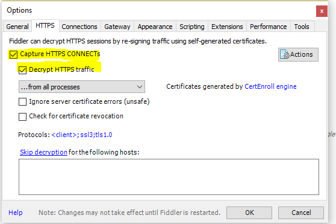
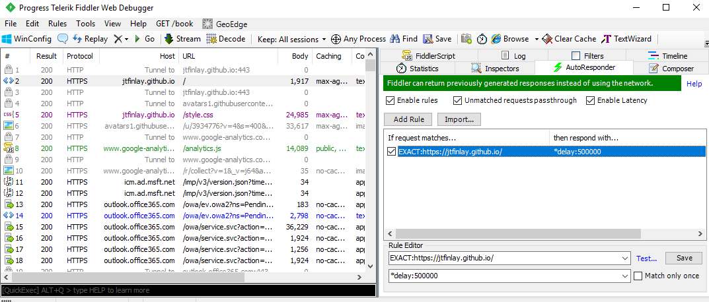

This is a quick post on a problem I recently hit working on a C# XAML application. When using a webview to navigate to a website, there is no default retry, timeout, or time tracking attributes available with XAML. Users could hit timeouts of over a minute, and there is no built in tracking to handle these cases.

In this post we'll look at a designing a solution for providing timing, and also take a look at a great networking tool, [Fiddler](https://www.telerik.com/download/fiddler).

Code for this guide is available on [github](https://github.com/Jtfinlay/webview-navigate-sample).


# Starting off

In Visual Studio, create a new C# Universal App. We'll keep the design simple and add a new WebView to the MainPage's xaml.

    // MainPage.xaml

    <Page x:Class...>

        <Grid Background="{ThemeResource ApplicationPageBackgroundThemeBrush}">
            <WebView x:Name="_webView"/>
        </Grid>
    </Page>

In the code behind, point the webview to a known web page.

using Windows.UI.Xaml.Controls;

    // MainPage.xaml.cs

    namespace WebViewTimeoutTest
    {
        public sealed partial class MainPage : Page
        {
            public MainPage()
            {
                this.InitializeComponent();
                _webView.Navigate(new System.Uri("https://jtfinlay.github.io/"));
            }
        }
    }

On deploy, our webview should launch us to this blog's host page. Great!

Let's perform the navigation again, but this time have Fiddler sniffing the call. First, clear you local cache (run 'Disk Cleanup' on Windows) and launch Fiddler. Enable HTTPs decrypting through Tools > Options... > HTTPS (tab) > Check 'Capture HTTPS CONNECTs' and 'Decrypt HTTPS traffic'.

Note: Fiddler also has a 'Clear Cache' button on the top toolbar, but I find that Disk Cleanup catches more.



When launching the app and navigating to the page, you should see a capture for host `jtfinlay.github.io` to URL `/`, as well as some additional calls to load css and google-analytics. The first thing we want to see is what happens when the user load times out - how does XAML react? To do this, we can intercept the navigation call in Fiddler, and delay it.

In Fiddler, on the right panel, you will find a tab for the Autoresponder. This allows us to return generated responses instead of allowing the call through the network, so if you want to mock a specific return from an API (or force a timeout error), this is the place to do it. If this is your first time using Fiddler, you should see an empty window taking most of the view. From the left tab, select the `jtfinlay.github.io` capture, and drag it to the right side. When you drop it in the window, it will set up a new rule to intercept any captures that match the host exactly, and return a 200. Instead of returning a 200, we can just delay the network call for 500 seconds with the following:

    *delay:500000

Press 'Save' in the Rule Editor. At the top of the view, select the 'Unmatched requests passthrough' option (or you'll block all unmatched traffic), and the option to 'Enable rules'



Run disk cleanup and deploy once more. You'll find, while waiting 500 seconds, that the XAML webview navigation will never... time... out... It is controlled entirely by the amount of time it takes for the call to complete.

# Solution

In our solution, there are three key items we are looking for:

 1. After a set amount of time, the navigation has 'timed out' and should be cancelled.
 2. Allow 3 retries for navigation, from either timeout or other 5xx issues.
 3. Keep track of the time elapsed, for logging or telemetry purposes.

To keep the code reusable, we will split it apart from the MainPage into a separate class. NavigationCompleted will be handled by an event delegate as well, since it is triggered when the page navigates from user action - not just when we call `Navigate()`.

Let's create a class called `WebviewNavigator`. Not the prettiest name, but it's to the point and doesn't have the overused terms `Manager` or `Helper`. We'll define some constants and methods to expect. There are a few different Webview.Navigate(...) methods available to us, but we'll just be using `Uri` and `HttpRequestMessage` for now.

```c
// WebviewNavigator.cs

using System;
using Windows.UI.Xaml.Controls;

namespace WebviewNavigateTest
{
    public class WebviewNavigator
    {
        /// <summary>
        /// The maximum number of attempts to try a navigation.
        /// </summary>
        private const int MAX_RETRY_COUNT = 3;

        /// <summary>
        /// The maximum time allowed to perform a navigation.
        /// </summary>
        private const int MAX_TIMEOUT_MS = 30000;

        /// <summary>
        /// Access to the wrapped webview instance
        /// </summary>
        private readonly WebView _webView;

        public WebviewNavigator(WebView webView)
        {
            _webView = webView;
            _webView.NavigationCompleted += OnNavigationCompleted;
        }

        public void Navigate(Uri source)
        {
        }

        public void NavigateWithHttpRequestMessage(HttpRequestMessage requestMessage)
        {
        }

        private void OnNavigationCompleted(WebView sender, WebViewNavigationCompletedEventArgs args)
        {
        }
    }
}
```

We need two different timing mechanisms. First, we want to track how long each navigation request takes. Second, we want to be alerted when we hit the timeout so we can cancel the ongoing navigation. 

In the first case, there are a lot of different options we can use. A great option is [Stopwatch](https://msdn.microsoft.com/en-us/library/system.diagnostics.stopwatch(v=vs.110).aspx), which can be used to start, stop, and reset a timer.

For the second timer needed, we could have a loop that checks whether the timer is elapsed - but there are far better ways. The [DispatcherTimer](https://docs.microsoft.com/en-us/uwp/api/windows.ui.xaml.dispatchertimer) is a much better approach. We will provide the DispatcherTimer with a specific time interval and, after that time, it will process a block of code. Sadly, it does not support a 'how long has this been running?' check, so it only helps us with option B.

We will create an instance of `Stopwatch`

```c
using System;
using System.Diagnostics;
using Windows.UI.Xaml;
using Windows.UI.Xaml.Controls;
using Windows.Web.Http;

namespace WebviewNavigateTest
{
    public class WebviewNavigator
    {
        /// <summary>
        /// The maximum number of attempts to try a navigation.
        /// </summary>
        private const int MAX_RETRY_COUNT = 3;

        /// <summary>
        /// The maximum time allowed to perform a navigation.
        /// </summary>
        private const int MAX_TIMEOUT_MS = 30000;

        /// <summary>
        /// Access to the wrapped webview instance
        /// </summary>
        private readonly WebView _webView;

        private readonly Stopwatch _stopwatch = new Stopwatch();

        private readonly DispatcherTimer _countdownTimer = new DispatcherTimer()
        {
            Interval = new TimeSpan(0, 0, 0, 0, MAX_TIMEOUT_MS)
        };

        public WebviewNavigator(WebView webView)
        {
            _webView = webView;
            _webView.NavigationCompleted += OnNavigationCompleted;

            _countdownTimer.Tick += OnTimeoutElapsed;
        }

        ...

        private void OnTimeoutElapsed(object sender, object e)
        {
        }
    }
}
```

Great, things are initialized. There is one more piece we need to think through however - the *retry*. We are not always navigating to a `Uri`, but we could be using a `HttpRequestMessage`, or any other navigation types as well. We need a way to generalize the method call so we can recall it in case of failure. Using an [`Action delegate`](https://msdn.microsoft.com/en-us/library/018hxwa8(v=vs.110).aspx) will help us with this.


    ...

    /// <summary>
    /// Keep track of the desired navigation.
    /// </summary>
    private Action _navigationAction;

    /// <summary>
    /// Number of navigation attempts
    /// </summary>
    private int _navigationAttempt = 1;

    ...

    public void Navigate(Uri source)
    {
        _navigationAction = () => _webView.Navigate(source);
        Navigate();
    }

    public void NavigateWithHttpRequestMessage(HttpRequestMessage requestMessage)
    {
        _navigationAction = () => _webView.NavigateWithHttpRequestMessage(requestMessage);
        Navigate();
    }

And we can add a new `Navigate` method that will invoke the new action. In `OnNavigationCompleted` and `OnTimeoutElapsed`, we add our retry logic.

    private void Navigate()
    {
        _stopwatch.Restart();
        _countdownTimer.Start();

        _navigationAction.Invoke();
    }
    
    private void OnTimeoutElapsed(object sender, object e)
    {
        _webView.Stop();

        _stopwatch.Stop();
        _countdownTimer.Stop();

        _navigationAttempt++;
        if (_navigationAttempt > MAX_RETRY_COUNT)
        {
            // TODO: We've failed with timeout error
            return;
        }

        Navigate();
    }

    private void OnNavigationCompleted(WebView sender, WebViewNavigationCompletedEventArgs args)
    {
        _stopwatch.Stop();
        _countdownTimer.Stop();

        if (args.IsSuccess)
        {
            // TODO: Navigation successful
            return;
        }

        _navigationAttempt++;
        if (_navigationAttempt > MAX_RETRY_COUNT)
        {
            // TODO: We've failed with most recent error.
            return;
        }

        Navigate();
    }

The one piece we are missing is alerting the caller to any completed navigations. We'll keep the same pattern as the Webview, which uses a `TypedEventHandler` with an instance of `WebViewNavigationCompletedEventArgs`. We can receive webview NavigationCompleted events from actions we do not perform ourselves (such as navigations from the loaded page), so we don't want to restrict the caller by changing default behaviour on this point. One item we *will* have to change is the use of `WebViewNavigationCompletedEventArgs`, since we cannot instantiate an instance of this object ourselves for timeout exceptions. We can easily duplicate the behaviour.

    // WebViewNavigationSuccessArgs.cs

    using System;
    using Windows.UI.Xaml.Controls;
    using Windows.Web;

    namespace WebviewNavigateTest
    {
        public class WebViewNavigationSuccessArgs
        {
            public bool IsSuccess { get; private set; }

            public Uri Uri { get; private set; }

            public WebErrorStatus WebErrorStatus { get; private set; }

            public WebViewNavigationSuccessArgs(WebViewNavigationCompletedEventArgs args)
            {
                IsSuccess = args.IsSuccess;
                Uri = args.Uri;
                WebErrorStatus = args.WebErrorStatus;
            }

            public WebViewNavigationSuccessArgs(bool isSuccess, Uri uri, WebErrorStatus webErrorStatus)
            {
                IsSuccess = isSuccess;
                Uri = uri;
                WebErrorStatus = webErrorStatus;
            }
        }
    }

Back in the navigator, we can add a new event...

    public event TypedEventHandler<WebView, WebViewNavigationSuccessArgs> NavigationCompleted;

Next, update the OnNavigationCompleted TODOs with...

    NavigationCompleted?.Invoke(sender, new WebViewNavigationSuccessArgs(args));

And last but not least, we replace the TODO in `OnTimeoutElapsed` with a new instance of `WebViewNavigationSuccessArgs` that uses the timeout. In this case, we are returning `null` for the `Uri` parameter, but we could always persist a Uri property beside the `Action` when navigation is invoked.

    NavigationCompleted?.Invoke(_webView, new WebViewNavigationSuccessArgs(false, null, Windows.Web.WebErrorStatus.Timeout));

We can now test this behaviour with Fiddler. Update `MainPage.xaml.cs` to use `WebviewNavigator`, and ensure Fiddler's autoresponder is delaying the network calls. Let's drop `MAX_TIMEOUT_MS` to a smaller value so we don't lose our patience (2000 milliseconds such suffice). Deploy, and test that after three attempts, the `NavigationCompleted` event triggers with a timeout failure. 

With Fiddler, we can also test that it succeeds after one timeout error, by selecting 'Match only once' in the AutoResponder's Rule Editor.

# Wrapping Up

I hope this helps some folks out. Some recommendations from this guide would be to have a 'CancelNavigation' method that's called when Navigation is invoked, in case there are any ongoing network call. Also, placing this object behind tests is always useful - try hiding the webview behind a custom interface and passing in a mock object to force navigation events.

Code is available on [github](https://github.com/Jtfinlay/webview-navigate-sample).